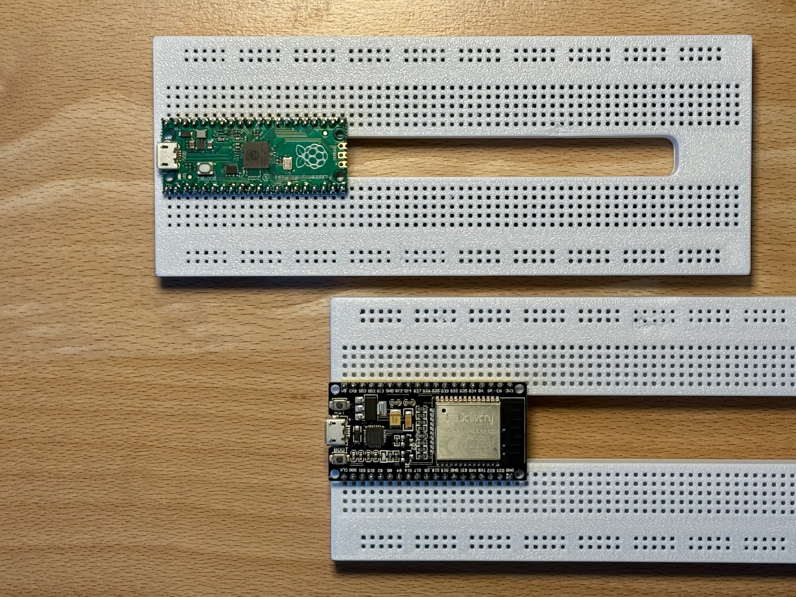
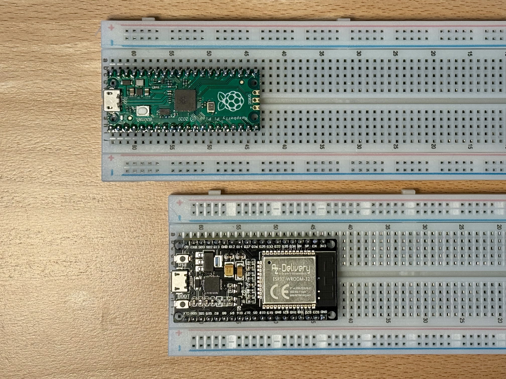

# Fixing Breadboards for Wide Microcontrollers – Pico & ESP32 Edition

This project provides a custom 3D-printed breadboard body designed to accommodate modern, wide microcontroller development boards such as the **Raspberry Pi Pico** and **ESP32 Dev Board**. The metal spring contacts from a standard commercial breadboard are removed and reused inside the new housing, giving you a full-size 63×5 contact area and two power rails — just like the real thing.

## ✨ Why?

Many modern µC boards are too wide for typical solderless breadboards:

- With a **Raspberry Pi Pico**, only two holes per pin remain usable.
- With an **ESP32 Dev Board**, no holes remain at all — you need two breadboards side by side.

With this custom breadboard, the microcontroller sits in the middle, leaving **four free holes per pin** for jumper wires and components — ideal for prototyping.

## 📦 Features

- Full 63×5 breadboard layout
- Two vertical power rails (left & right)
- Contact springs **recycled** from an existing breadboard
- Two variants:
  - **Pico version:** 7×2.54 mm pin spacing (17.78 mm)
  - **ESP32 version:** 10×2.54 mm pin spacing (25.40 mm)
- Optional screw-mounted bottom plate
- Fully 3D-printable design (Fusion 360 source included)

## 📁 Included Files

This repository contains:

- /ESP32dev/          – Source CAD file, STL model, 3MF file for ESP32 development board
- /RaspberryPiPico/   – Source CAD file, STL model, 3MF file for Raspberry Pi Pico
- /photos/            – Build & assembly photos (for documentation)
- readme.md           - this file
- license.txt         - license

## 🖨 Printing Notes

- Material: **PLA** works well (ABS/ASA for heat resistance)
- Layer height: 0.2 mm recommended
- Infill: 50%
- Supports: Not required for main board
- Optional: Pause print to insert M2 nuts for screw mounting

Alternatively, the bottom plate may be **glued** instead of screwed.

## 🛠 Assembly Overview

1. Remove bottom adhesive tape from a commercial breadboard
2. Extract the metal spring contacts (keep power rails separate)
3. Insert contacts into the 3D-printed body
4. Insert power rails on both sides
5. Mount or glue the bottom plate
6. Plug in Pico or ESP32 and start prototyping!

## 📷 Photos & Documentation

See the Instructables article for full build documentation and photos:  
*link coming soon*

## 📝 Inspiration & Credits

The concept was inspired by the MAKE Advent Calendar project on Tinkercad:  
[MAKE ESP Breadboard](https://www.tinkercad.com/things/bsXsvygyo6F-make-esp-breadboard)
This version expands the idea to a **full-length 63-row breadboard** with **complete power rails**.

## 📜 License
Creative Commons Attribution-NonCommercial-ShareAlike 4.0 (CC BY-NC-SA 4.0)
see license.txt